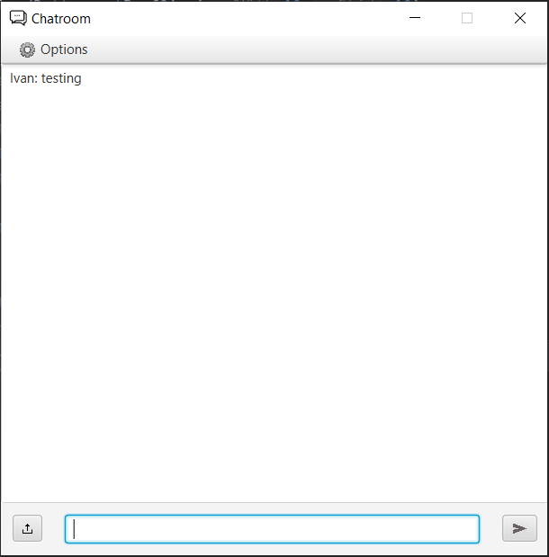

# Client Server Messenger
## Information
This program allows multiple users to communicate with each other across distance through a chat room using client-server connection. The Messenger also has the additional function of uploading messages from a text file as well as downloading messages to a text file.

## How to run and use
Either download or clone the repository to obtain
the code. The source code can be used to run the program in any preffered IDE assuming JavaFx is installed. But, IntelliJ is recommended as that is what was used to create this project. First, the Server code needs to run before the Client code can be ran. When the client connects to the server, that is when they will be able to enter the chatroom. The first thing a user will be able to do is choose a username for themselves. The username can be changed in the options menu in the upper left section of the window if the user is not happy with their username. After the username has been chosen, the user will now be able to send messages to other people through the textbox at the bottom. All messages sent and received will be displayed on the user's screen. The upload button (bottom left) will allow the user to choose a text file from their computer that will be sent as as message. The download button (upper left menu) will allow the user to download the current messages to a text file. The stats button (upper left menu) will open a new window that will show the statistics of the chatroom. The user can exit the chatroom at any time by pressing the exit button (upper left menu) or by simply closing the window.

## Other Resources
https://wittcode.com/
 https://docs.oracle.com/javase/tutorial/essential/io/buffers.html
 https://www.guru99.com/buffered-reader-in-java.html
 https://riptutorial.com/javafx/example/6967/hbox-and-vbox
 https://www.baeldung.com/a-guide-to-java-sockets
 https://docs.oracle.com/javase/8/javafx/api/javafx/stage/FileChooser.html
 https://fxdocs.github.io/docs/html5/
 https://docs.oracle.com/javase/8/javafx/interoperability-tutorial/concurrency.htm
 https://docs.oracle.com/javase/8/javafx/api/javafx/scene/image/ImageView.html
